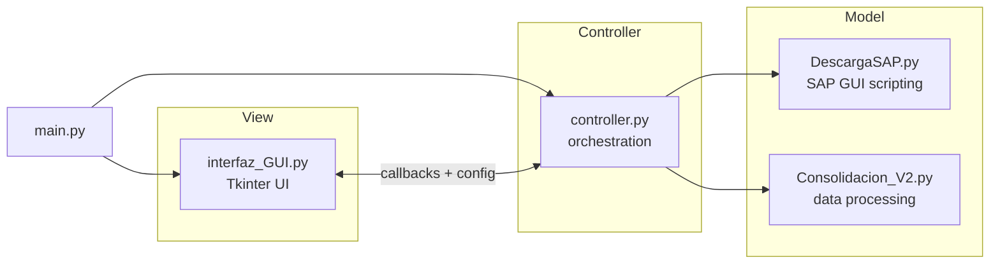

# Intercompany SAP Extraction & Reconciliation Tool

> A one‑click Windows desktop application that automates the extraction of SAP financial line‑item reports and consolidates them into audit‑ready intercompany reconciliation workbooks — replacing a slow, manual, error‑prone process with a reproducible pipeline.


---

## Table of Contents

- [Overview](#overview)
- [Why it matters for audit & controls](#why-it-matters-for-audit--controls)
- [Key features](#key-features)
- [How it works](#how-it-works)
- [Architecture](#architecture)
- [Project structure](#project-structure)
- [The consolidated output](#the-consolidated-output)
- [Requirements & installation](#requirements--installation)
- [Usage](#usage)
- [Configuration reference](#configuration-reference)
- [Engineering highlights](#engineering-highlights)
- [Troubleshooting](#troubleshooting)
- [Building a standalone executable](#building-a-standalone-executable)
- [Tech stack](#tech-stack)
- [Notes on this repository](#notes-on-this-repository)

---

## Overview

Intercompany reconciliation requires pulling the same family of SAP line‑item reports for many company codes, cleaning them, matching vendor/customer documents against their general‑ledger postings, and building a per‑company summary matrix that finance and audit can review. Done by hand, this means dozens of manual SAP exports, repetitive copy‑paste, and hours of spreadsheet wrangling per period — with every manual step a place for an error to slip in.

This tool turns that entire workflow into a desktop application with three actions:

1. **Download** — automates SAP GUI to extract the vendor, customer, G/L, and vendor‑catalog reports for every selected company code and date range.
2. **Download (large companies)** — a memory‑safe variant that splits the heaviest report into document blocks so extractions that would otherwise crash the SAP session complete reliably.
3. **Consolidate** — cleans, enriches, and pivots the extracted data into a single multi‑sheet reconciliation workbook per company code.

The result: a repeatable, one‑operator process that produces the same output every time, frees analysts from manual downloading, and leaves a clean audit trail.

**The problem it solves, in one line:** turn a multi‑hour, manual, copy‑paste SAP reconciliation into a reproducible, one‑click pipeline.

---

## Why it matters for audit & controls

This project was built with an auditor's mindset, and several design choices reflect that directly:

- **Built‑in auditor annotation columns.** Every consolidated file ships two blank columns — `Concepto Intercompañias` (intercompany concept) and `UUID Auditor` — inserted at a fixed position in the vendor and customer G/L sheets so a reviewer has a consistent, structured place to annotate findings and tag documents.
- **Reconciliation matrices, not just data dumps.** For each company code the tool builds a pivot of amounts by counterparty and G/L account, with dedicated **Totals**, **Balance check (Cuadre Balanza)**, and **Variance** rows — the skeleton an auditor uses to prove that subledger detail ties to the balance.
- **Reproducibility over convenience.** The same inputs always produce the same output. There is no hidden manual step, so a reviewer can re‑run the process and get an identical file.
- **Deterministic handling of empty populations.** When a company code has no vendor or customer movements, the tool records that fact and generates explicit empty matrices instead of silently failing or producing a partial file — so "no data" is a documented, auditable outcome rather than a gap.
- **Safe configuration parsing.** Persisted account configuration is parsed with `ast.literal_eval` (never `eval`), so loading a config file can't execute arbitrary code.
- **Full source traceability.** Every figure in the consolidated workbook is retained on its own raw sheet (the untouched SAP extract) alongside the derived matrix, so any number can be traced back to source.

---

## Key features

- **Multi‑company, multi‑report extraction** driven by SAP GUI Scripting — vendor line items, customer line items, G/L line items, and the vendor catalog, for any list of company codes and any posting‑date range.
- **Two download modes:** a standard mode for normal‑volume companies, and a **chunked mode for large companies** that divides the G/L extraction into configurable document blocks to avoid SAP session memory errors.
- **Automatic SAP session reset** between the vendor and customer phases of a large extraction, to release accumulated session memory that would otherwise crash the first customer block.
- **Two consolidation modes:** **Manual** (filter G/L postings to a curated set of accounts per company code) and **Automatic** (keep every account present in the extract).
- **No‑code configuration:** company codes, account ranges, per‑company account lists, block sizes, and working folders are all set from the UI and persisted to disk.
- **Resilient to empty results:** missing movements produce documented empty placeholders, not crashes.
- **Portable:** paths resolve relative to the current Windows user, so it runs on any machine without re‑configuration; it can also be packaged into a standalone `.exe` that needs no Python install.

---

## How it works

### 1 · Standard download (normal‑volume companies)

For each selected company code, in order:

| Step | SAP report | Output file |
|------|-----------|-------------|
| 1 | Vendor line items (FBL1N) | `FBL1_Proveedores_{company}.xlsx` |
| 2 | Vendor catalog (custom Z‑transaction) | `ZFIQ02_Proveedores_{company}.xlsx` |
| 3 | G/L line items (FBL3N) for the vendor documents | `FBL3N_Proveedores_{company}.xlsx` |
| 4 | Customer line items (FBL5N) | `FBL5N_Clientes_{company}.xlsx` |
| 5 | G/L line items (FBL3N) for the customer documents | `FBL3N_Clientes_{company}.xlsx` |

The G/L extraction is driven by the document numbers found in the corresponding vendor/customer report: the tool reads the document‑number column, de‑duplicates it, and feeds that list into FBL3N. If a vendor or customer report returns no items, the tool writes an empty placeholder file and skips the matching G/L step.

### 2 · Large‑company download (chunked G/L extraction)

Some company codes post hundreds of thousands of documents, and a single full FBL3N run over that many document numbers exhausts SAP's session memory and crashes. This mode solves that:

- Vendor (FBL1N) and customer (FBL5N) reports are still pulled **in full** — they are not the bottleneck.
- **Only FBL3N is chunked:** the unique document list is split into blocks of a configurable size, each block is exported to its own temporary file, and the blocks are then stacked back into one final file.
- Between the vendor phase and the customer phase, the tool **resets the SAP session** (navigates to `/n`) and pauses, releasing the memory accumulated across all vendor blocks before the customer blocks begin.

```mermaid
flowchart TD
    A[Select company codes + date range] --> B{Download mode}
    B -->|Standard| C[Full FBL1N / ZFIQ02 / FBL3N / FBL5N / FBL3N]
    B -->|Large| D[Full FBL1N + vendor catalog]
    D --> E[FBL3N vendors in document blocks]
    E --> F[Stack vendor blocks → final file]
    F --> G[Reset SAP session /n + pause]
    G --> H[Full FBL5N]
    H --> I[FBL3N customers in document blocks]
    I --> J[Stack customer blocks → final file]
    C --> K[Per-company flags file: sin_proveedores / sin_clientes]
    J --> K
    K --> L[Consolidation]
    L --> M[Intercompanias_Consolidado_&#123;company&#125;.xlsx]
```



### 3 · Consolidation

For each company code the consolidation step:

1. **Loads** the vendor, vendor‑catalog, and G/L reports (vendor side) plus the customer line items, customer catalog, and G/L report (customer side).
2. **Cleans** every column of stray tabs, line breaks, and whitespace.
3. **Enriches** the data with merges: vendor line items ↔ vendor catalog to attach the vendor name; G/L ↔ vendor to attach the counterparty name and document texts (the same pattern is applied on the customer side).
4. **Filters by account** — in Manual mode it keeps only the configured accounts for that company; in Automatic mode it keeps everything.
5. **Builds the matrix** — a pivot of local‑currency amount by counterparty and account, with Totals, Balance‑check, and Variance rows, a header row carrying the company code / name / account descriptions, and the two blank auditor columns.
6. **Exports** a single multi‑sheet workbook per company code.

A per‑company flags file written during download (`_flags_{company}.json`) tells the consolidation whether to expect empty vendor or customer populations, so it generates empty matrices instead of erroring on missing files.

---

## Architecture

The application follows a clean **Model–View–Controller** separation, which keeps the SAP‑automation, business‑logic, and UI concerns independent and testable:



| Component | Responsibility |
|-----------|----------------|
| `main.py` | Entry point — instantiates the view and controller and wires them together. |
| `interfaz_GUI.py` | The Tkinter view. A 1000×750 window with a **Process** tab (dates, download buttons, chunk sizes, consolidation mode) and a **Configuration** tab (company codes, account ranges, working paths, and editable per‑company account tables with TXT persistence). Holds no business logic — it exposes state through `get_config()` and invokes controller callbacks. |
| `controller.py` | Orchestrates the three workflows: standard download, chunked large‑company download, and consolidation. Owns the chunking logic, the SAP session reset, block stacking, the per‑company flags, and Excel/COM housekeeping. |
| `DescargaSAP.py` | All SAP GUI Scripting via `win32com`: one function per report (FBL1N, the vendor catalog, FBL3N, FBL5N), plus helpers for "no items" detection, subsidiary‑popup handling, and confirming a file reached disk. |
| `Consolidacion_V2.py` | The data‑processing model: cleaning, merges, account filtering, pivoting into matrices, and writing the multi‑sheet workbook. Runs standalone or via the controller. |

---

## Project structure

```
Intercompany/
│
├── main.py                  # Entry point (wires View + Controller)
├── interfaz_GUI.py          # View — Tkinter UI
├── controller.py            # Controller — orchestration & business logic
├── DescargaSAP.py           # Model — SAP GUI scripting (extraction)
├── Consolidacion_V2.py      # Model — cleaning, matrices, consolidation
├── build_exe.py             # PyInstaller build script
├── requirements.txt         # Python dependencies
├── .gitignore
└── README.md
```

At runtime the app creates its own working tree under the current user's Documents folder (paths are configurable from the UI):

```
Documents/Intercompañias/RDA_Intercompanias/src/
├── Input/
│   ├── Proveedores/                 # vendor-side extracts (FBL1N, catalog, FBL3N)
│   ├── Clientes/                    # customer-side extracts (FBL5N, FBL3N, catalog)
│   │   └── Clientes_Catalogo.xls    # ← placed manually  (REQUIRED)
│   ├── Sociedad_Nombre.xls          # ← placed manually  (optional enrichment)
│   └── Cuentas_Desc.xls             # ← placed manually  (optional enrichment)
├── Output/
│   └── Intercompanias_Consolidado_{company}.xlsx
└── config/
    ├── cuentas_proveedores_por_sociedad.txt   # persisted vendor accounts
    └── cuentas_clientes_por_sociedad.txt      # persisted customer accounts
```

> Everything except the three manually‑placed input files is created automatically on first launch.
>
> **Required vs optional inputs:** only `Clientes_Catalogo.xls` (the customer master/catalog) is strictly required for consolidation. `Sociedad_Nombre.xls` (company names) and `Cuentas_Desc.xls` (account descriptions) are **optional** — if present they enrich the matrix header rows; if absent, consolidation still runs. (All three are tab‑separated, UTF‑16 SAP text exports that carry an `.xls` extension.)

---

## The consolidated output

Each company code produces one workbook, `Intercompanias_Consolidado_{company}.xlsx`, with **8 sheets** — four raw source sheets and their derived counterparts on both the vendor and customer sides:

| # | Sheet | Content |
|---|-------|---------|
| 1 | `FBL1N` | Raw vendor line items, enriched with vendor name |
| 2 | `Cat Proveedores` | Vendor catalog (master) |
| 3 | `FBL3N Proveedores` | Vendor G/L postings, enriched with counterparty + document texts + auditor columns |
| 4 | `Matriz Proveedores` | Vendor reconciliation matrix (pivot + Totals / Balance‑check / Variance) |
| 5 | `FBL5N` | Raw customer line items, enriched with customer name |
| 6 | `Cat Clientes` | Customer catalog (master) |
| 7 | `FBL3N Clientes` | Customer G/L postings, enriched + auditor columns |
| 8 | `Matriz Clientes` | Customer reconciliation matrix (pivot + Totals / Balance‑check / Variance) |

Keeping raw and derived sheets side by side is deliberate: every figure in a matrix can be traced straight back to its untouched SAP source in the same file.

---

## Requirements & installation

**Software**

- Windows (required — the tool automates the Windows SAP GUI via COM).
- Python 3.8+
- SAP GUI with **scripting enabled** (SAP GUI Options → Accessibility & Scripting).
- Microsoft Excel installed (used as a COM intermediary by parts of the extraction).

**Python dependencies** (`requirements.txt`)

```
pandas
pywin32
openpyxl
pyperclip
xlrd
```

**Install**

```bash
pip install -r requirements.txt
```

**Run**

```bash
python main.py
```

---

## Usage

### Process tab

1. **Set the date range** — *From* and *To* in `DD.MM.YYYY` format. The app validates the format and rejects a *From* later than *To*.
2. **Add company codes** — on the Configuration tab, type a company code and press *Add* (or Enter). Duplicates are rejected.
3. **Choose a download path:**
   - **⚡ Download Normal Companies** — full extraction for manageable volumes.
   - **🏢 Download Large Companies** — full FBL1N/FBL5N plus chunked FBL3N; set the *documents per block* for vendors and customers first.
4. **Consolidate — 📊 Reconcile / Consolidate** — pick the account mode (Manual or Automatic) and run.

A status bar at the bottom reflects live progress for the active process.

### Configuration tab

- **Company codes** and the **G/L account ranges** used by the FBL1N (vendor) and FBL5N (customer) extractions.
- **Working paths** for vendor input, customer input, and output — changeable without touching code; they default relative to the current Windows user.
- **Per‑company account tables** (vendors and customers) that drive **Manual** consolidation. Add/update a company's accounts (comma‑separated), then **Save TXT** to persist them to `config/`. These files are loaded automatically on the next launch; if none exist, built‑in defaults apply.

---

## Configuration reference

> ℹ️ **The identifiers below are anonymized, illustrative placeholders.** Real company codes, chart‑of‑accounts numbers, and SAP layout‑variant names have been generalized for this public repository.

**Account ranges** (defaults, editable in the UI)

| Report | Purpose | Range shape |
|--------|---------|-------------|
| FBL1N | Vendor accounts | a configurable ~10‑digit vendor‑account range |
| FBL5N | Customer accounts | a configurable ~6‑digit customer‑account range |

*(The real default bounds are set in the UI; the numeric values are internal chart‑of‑accounts identifiers and are omitted here.)*

**Per‑company account lists** — in **Manual** mode, only these G/L accounts are kept per company code. Structure (illustrative):

| Company code | Vendor accounts (example) | Customer accounts (example) |
|--------------|---------------------------|-----------------------------|
| `CO01` | `AP‑1, AP‑2, AP‑3` | `AR‑1, AR‑2, AR‑3` |
| `CO02` | `AP‑1` | `AR‑1` |
| `CO03` | `AP‑1 … AP‑7` | `AR‑1 … AR‑5` |
| *(any other)* | default `AP‑1` | default `AR‑1` |

**SAP layout variants** — the extraction selects a saved SAP display variant for each report (a vendor layout for FBL1N, a customer layout for FBL5N, and a G/L layout for FBL3N). The real variant names are internal and have been omitted here; the equivalent variants must exist in your SAP system for the exports to match the expected column structure.

**Chunk sizes for large companies**

- UI defaults shown on screen: **15,000** documents/block (vendors) and **1,000** documents/block (customers).
- Defensive code fallback if a field is left blank or invalid: **2,500** (vendors) / **500** (customers).
- Both are editable at runtime — no code change required.

---

## Engineering highlights

A few implementation details worth calling out:

- **SAP session memory management.** Every transaction is prefixed with `/n` for a clean navigation, and the large‑company flow issues an explicit session reset between the vendor and customer phases. This was the fix for a real failure mode: the first customer G/L block would crash because the session still carried the weight of every vendor block before it.
- **Chunking only where it's needed.** FBL1N and FBL5N are always pulled whole; only FBL3N — the report that blows up on huge document lists — is split and re‑stacked, keeping the design as simple as the problem allows.
- **Robust success checks.** A block counts as successful only when the function returns truthy **and** the file actually exists on disk (`ok and os.path.exists(path)`), guarding against silent `None`/`False` returns. Stacking ignores blocks flagged "no data" and empty frames.
- **"No items" detection.** SAP's `MSITEM030` / `MSITEM033` "no line items selected" messages are detected from both the status bar and popup text; when seen, the tool closes the dialog and writes an empty placeholder so downstream steps stay deterministic.
- **Customer subsidiary popup handling.** FBL5N's subsidiary/head‑office popup is dismissed programmatically until it clears.
- **Safe config persistence.** Per‑company accounts are written as a Python‑literal dict and read back with `ast.literal_eval` — never `eval` — so a config file can't smuggle in executable code.
- **Deliberate synchronization pauses.** SAP GUI Scripting is not fully synchronous; the timed waits between steps give large exports time to finish before the next action fires.
- **Portability.** All default paths resolve from the current user's profile, so the tool runs unmodified on any Windows machine and can be frozen into a standalone executable.

---

## Troubleshooting

| Symptom | Likely cause / fix |
|--------|--------------------|
| "Files not found" during consolidation | Run the download first; confirm `Clientes_Catalogo.xls` is in `Input/Clientes/` and all extracts exist. |
| First customer FBL3N block crashes (large mode) | Accumulated SAP session memory. The tool already resets the session and pauses; if it persists, increase the pause in the session‑reset step. |
| SAP returns "no items" for a company that has movements | The FBL1N/FBL5N account range may be too narrow, or the date range is wrong. |
| COM / SAP error | Ensure SAP GUI scripting is enabled, the session isn't locked (expired login, error popup), and the required layout variants exist. |
| "Invalid date format" | Use exactly `DD.MM.YYYY`, e.g. `01.01.2025`. |
| Company shows no data in the matrix | Manual mode: confirm the company is in the account table (otherwise the default account applies). Automatic mode: confirm the extracted FBL3N actually has rows. |

---

## Building a standalone executable

`build_exe.py` wraps PyInstaller to produce a distributable build that end users can run without installing Python:

```bash
python build_exe.py
```

It verifies the source files are present, installs PyInstaller if needed, and builds a windowed (no‑console) app named `Intercompanias`, bundling the hidden imports PyInstaller doesn't auto‑detect (`openpyxl`, `pandas`, `win32com`, `pyperclip`, `xlrd`). SAP GUI must be open and connected before using the download features, and the app creates its working folders on first run.

---

## Tech stack

- **Language:** Python 3.8+
- **UI:** Tkinter (`ttk`)
- **SAP automation:** SAP GUI Scripting via `pywin32` (`win32com.client`)
- **Data:** pandas, openpyxl, xlrd
- **Clipboard bridge:** pyperclip (to feed document lists into SAP)
- **Packaging:** PyInstaller
- **Pattern:** Model–View–Controller

---

## Notes on this repository

- **Anonymization.** Company codes, G/L account numbers, and SAP layout‑variant names shown here are illustrative placeholders; the real internal identifiers have been generalized for public sharing. Some in‑code identifiers, sheet names, and status messages remain in Spanish, reflecting the tool's original operating environment.
- **Scope.** This is an internal finance‑automation tool published as a portfolio piece to demonstrate SAP automation, data engineering, and audit‑oriented design; it is not a general‑purpose product.
